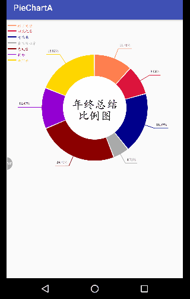

# PieChart
简单的饼状图

---
1、在xml中引用：

```
<com.infinite.piecharta.PieChart
        android:id="@+id/one"
        android:layout_width="match_parent"
        android:layout_height="match_parent"/>
```

2、代码中实例化view

3、设置元素
自定义的实体类，需要实现 *IPieElement* 接口

```
        TestEntity entity = new TestEntity(50, "#FF7F50", "断了的弦");
        TestEntity entity1 = new TestEntity(38, "#DC143C", "以父之名");
        TestEntity entity2 = new TestEntity(79, "#00008B", "青花瓷");
        TestEntity entity3 = new TestEntity(20, "#A9A9A9", "夜的第七章");
        TestEntity entity4 = new TestEntity(105, "#8B0000", "东风破");
        TestEntity entity5 = new TestEntity(53, "#9400D3", "稻香");
        TestEntity entity6 = new TestEntity(80, "#FFD700", "七里香");

        List<IPieElement> list=new ArrayList<>();
        list.add(entity);
        list.add(entity1);
        list.add(entity2);
        list.add(entity3);
        list.add(entity4);
        list.add(entity5);
        list.add(entity6);
        one.setData(list);
```
4、设置文字

```
one.setTitleText("年终总结比例图");
```

### update:
#### v12
<ol>
<li>添加了点击事件的回调<li>添加图例展示
<ol>
---
#### v13
<ol>
<li>添加了点击动画效果
<ol>

